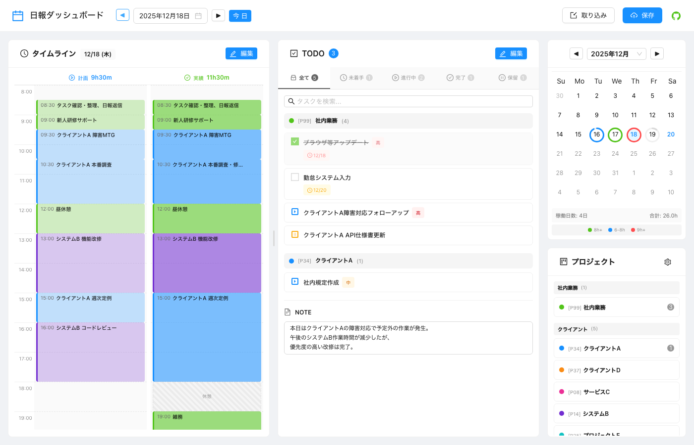

# mdJournal

**Markdown日報を視覚的に管理するダッシュボードアプリケーション**

[](https://www.npmjs.com/package/mdjournal)
[](https://opensource.org/licenses/MIT)

<p align="center">
  
</p>

## ✨ 特徴

- 📅 **カレンダービュー** - 月表示で稼働時間を可視化
- ⏱️ **タイムライン** - 計画と実績を並べて表示、ドラッグ&ドロップで編集
- ✅ **TODO管理** - プロジェクト別・ステータス別のタスク管理
- 📝 **Markdown編集** - 慣れ親しんだMarkdown形式でデータを管理
- 🔗 **外部連携** - Git commit/push、Slack投稿

---

## 🚀 まずは試してみる

```bash
# サンプルデータで起動（インストール不要）
npx mdjournal

# ブラウザが自動で開きます（http://localhost:3001）
```

これだけでサンプル日報を使ってダッシュボードを体験できます。

---

## 📦 セットアップ

自分の日報を管理するためのセットアップ手順です。

### 1. 日報用ディレクトリを作成

```bash
mkdir my-journal
cd my-journal
```

### 2. 設定ファイルを作成

```yaml
# mdjournal.config.yaml
projects: ./config/projects.yaml
routines: ./config/routines.yaml
reports: ./data

timeline:
  snapMinutes: 15         # ドラッグ時のスナップ単位（分）
  defaultStartHour: 8     # 表示開始時刻
  defaultEndHour: 20      # 表示終了時刻

server:
  port: 3001
```

### 3. プロジェクト定義を作成

```yaml
# config/projects.yaml
projects:
  - code: P01
    name: 社内業務
    color: "#52c41a"

  - code: P02
    name: プロジェクトA
    color: "#1890ff"

  - code: P03
    name: プロジェクトB
    color: "#722ed1"
```

### 4. ルーチン定義を作成（オプション）

毎週決まった予定がある場合、ルーチンとして登録しておくと便利です。

```yaml
# config/routines.yaml
routines:
  weekly:
    monday:
      - time: "09:00"
        project: P01
        task: 週次定例会議
      - time: "10:00"
        project: P02
        task: プロジェクトA 朝会

    friday:
      - time: "17:00"
        project: P01
        task: 週報作成
```

### 5. ディレクトリ構成

最終的にこのような構成になります：

```
my-journal/
├── mdjournal.config.yaml    # メイン設定ファイル
├── config/
│   ├── projects.yaml        # プロジェクト定義
│   └── routines.yaml        # ルーチン定義
└── data/                    # 日報が保存される場所
    └── 2025/
        └── 01/
            ├── 2025-01-06.md
            └── 2025-01-07.md
```

### 6. 起動

```bash
npx mdjournal ./mdjournal.config.yaml
```

日報ファイルはダッシュボードから自動的に作成されます。

---

## 📝 日報の書き方

日報は以下のようなMarkdown形式です。ダッシュボードで編集できますが、テキストエディタで直接編集することもできます。

```markdown
# [日報] 山田太郎 2025-01-06

## [PLAN]

* 08:30 [P01] タスク確認・朝会
* 09:00 [P02] プロジェクトA 開発
* 12:00
* 13:00 [P03] プロジェクトB MTG
* 15:00 [P02] プロジェクトA 開発
* 18:00

## [RESULT]

* 08:30 [P01] タスク確認・朝会
* 09:00 [P02] プロジェクトA 開発
* 12:00
* 13:00 [P03] プロジェクトB MTG（延長）
* 16:00 [P02] プロジェクトA 開発
* 19:00

## [TODO]

### P01
- [ ] @2025-01-10 !!! 重要なタスク
- [*] !! 進行中のタスク

### P02
- [x] 完了したタスク
- [-] 保留中のタスク

## [NOTE]

本日のメモや振り返りをここに記載。
```

### タイムライン記法

```
* HH:MM [プロジェクトコード] タスク内容
* HH:MM                              ← 終了時刻のみ（空き時間の終わり）
```

- `[PLAN]` セクション: 予定
- `[RESULT]` セクション: 実績

### TODOの書き方

```markdown
- [ ] 未着手のタスク
- [*] 進行中のタスク
- [x] 完了したタスク
- [-] 保留中のタスク
```

#### 期日と優先度

```markdown
- [ ] @2025-01-10 期日付きタスク
- [ ] !!! 優先度：高
- [ ] !!  優先度：中
- [ ] !   優先度：低
- [ ] @2025-01-10 !!! 期日＋優先度の組み合わせ
```

---

## 🔗 外部連携

### Git連携

日報ディレクトリがGitリポジトリの場合、ダッシュボードの保存ボタンから直接commit/pushできます。

```bash
# 日報ディレクトリをGitリポジトリ化
cd my-journal
git init
git remote add origin <your-repo-url>
```

### Slack連携

日報をSlackチャンネルに投稿できます。

```yaml
# mdjournal.config.yaml に追加
slack:
  enabled: true
  webhookUrl: ${SLACK_WEBHOOK_URL}  # 環境変数から取得
  channel: "#daily_report"
```

環境変数の設定:

```bash
export SLACK_WEBHOOK_URL="https://hooks.slack.com/services/..."
```

### 保存ダイアログ

保存ボタンから開くダイアログで、保存範囲を選択できます：

1. **保存のみ** - ローカルファイルに保存
2. **Commitまで** - 保存 + Git commit
3. **Pushまで** - 保存 + commit + push
4. **Slack投稿** - 上記 + Slackに投稿（Slack連携が有効な場合）

---

## 🛠️ CLIコマンド

```bash
# サーバー起動
npx mdjournal [config.yaml]

# 日報ファイルのバリデーション
npx mdjournal validate ./data
npx mdjournal validate ./data --verbose  # 詳細表示
npx mdjournal validate ./data --strict   # 厳格モード

# 統計情報の再集計（frontmatter更新）
npx mdjournal stats ./data
npx mdjournal stats ./data --dry-run     # プレビューのみ

# 設定ファイルの検証
npx mdjournal config ./mdjournal.config.yaml
```

---

## ⚙️ 設定リファレンス

### タイムライン設定

```yaml
timeline:
  hourHeight: 60          # 1時間あたりの高さ（px）
  maxHours: 36            # 最大表示時間
  defaultStartHour: 8     # デフォルト開始時刻
  defaultEndHour: 20      # デフォルト終了時刻
  snapMinutes: 15         # スナップ単位（分）
```

### プロジェクト定義

```yaml
# config/projects.yaml
projects:
  - code: P01             # タイムラインで使用するコード
    name: 社内業務         # 表示名
    fullName: 社内管理・雑務  # フルネーム（オプション）
    color: "#52c41a"      # 表示色
    category: internal    # カテゴリID（オプション）
    active: true          # アクティブフラグ（デフォルト: true）

categories:               # カテゴリ定義（オプション）
  - id: internal
    name: 社内業務
    color: "#52c41a"
```

### ルーチン定義

```yaml
# config/routines.yaml
routines:
  # 週次ルーチン
  weekly:
    monday:
      - time: "09:00"
        project: P01
        task: 週次定例

  # 月次ルーチン
  monthly:
    start_of_month:       # 月初
      - project: P01
        task: 経費精算
    end_of_month:         # 月末
      - project: P01
        task: 月次レポート

  # 四半期ルーチン
  quarterly:
    - months: [3, 6, 9, 12]
      tasks:
        - project: P01
          task: 四半期レビュー
```

---

## 📄 ライセンス

MIT License

---

**mdJournal** - Markdownで日報をもっと便利に
